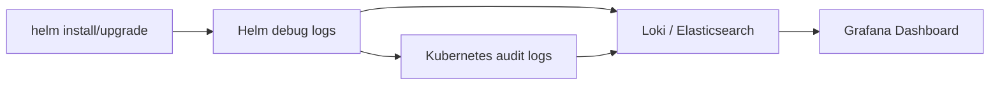

# Chapter 19: Production Best Practices

## Table of Contents

1. [Chart Versioning](#chart-versioning)
2. [Release Naming](#release-naming)
3. [Namespace Strategy](#namespace-strategy)
4. [Folder Structure](#folder-structure)
5. [Repository Layout](#repository-layout)
6. [Values Management](#values-management)
7. [Secrets Management](#secrets-management)
8. [Environment Separation](#environment-separation)
9. [Promotion Strategy](#promotion-strategy)
10. [Disaster Recovery](#disaster-recovery)
11. [Rollback Policy](#rollback-policy)
12. [GitOps](#gitops)
13. [Observability](#observability)
14. [Monitoring Helm](#monitoring-helm)
15. [Logging](#logging)
16. [Auditing](#auditing)
17. [Immutable Infrastructure](#immutable-infrastructure)
18. [Resource Limits and Requests](#resource-limits-and-requests)
19. [Health Checks](#health-checks)
20. [Atomic, Wait, and History-Max Flags](#atomic-wait-and-history-max-flags)
21. [Chart Dependencies](#chart-dependencies)
22. [Template Testing](#template-testing)
23. [CI Validation Pipeline](#ci-validation-pipeline)
24. [Production Deployment Checklist](#production-deployment-checklist)
25. [Anti-Patterns](#anti-patterns)

---

## Chart Versioning

### Semantic Versioning Strictly Enforced

Helm uses **SemVer 2.0.0** (`MAJOR.MINOR.PATCH`) natively. The `version` field in `Chart.yaml` is parsed and compared when resolving dependencies and computing upgrades.

```
version: 1.2.3
appVersion: "3.4.0"
```

- `version` — the chart's own version (must be SemVer).
- `appVersion` — the application version being packaged (informational, can be any string).

**Note:** Helm refuses to install or package a chart whose `version` does not conform to SemVer. The CLI command `helm package` will reject `version: 1.2` (missing patch) with `Error: chart "mychart" has an invalid version`.

### Version Bumping Strategy

| Change Type | Bump | Example |
|---|---|---|
| Backward-compatible bug fix | PATCH | `1.2.3` → `1.2.4` |
| New feature, backward-compatible | MINOR | `1.2.3` → `1.3.0` |
| Breaking change (template, default values, CRDs) | MAJOR | `1.2.3` → `2.0.0` |
| Pre-release (alpha, beta, rc) | Append suffix | `2.0.0-alpha.1`, `2.0.0-rc.3` |
| Build metadata | Append `+` | `1.2.3+build.2026` |

**Production Note:** Never use pre-release chart versions in production. Pre-release versions (`x.y.z-alpha`, `x.y.z-rc`) are excluded from `helm search repo` by default and are considered unstable.

#### Automated Bumping

```bash
# Using helm-docs or a CI script to bump the patch version
helm-chart-bump() {
  current=$(yq '.version' Chart.yaml)
  IFS='.' read -r major minor patch <<< "$current"
  new_patch=$((patch + 1))
  yq -i ".version = \"$major.$minor.$new_patch\"" Chart.yaml
}
```

### CHANGELOG.md

Every chart repository or monorepo chart directory must contain a `CHANGELOG.md`. Follow the [Keep a Changelog](https://keepachangelog.com) format:

```markdown
# Changelog

## [1.2.3] - 2026-07-11
### Fixed
- Fix replica count overriding bug when `replicaCount` is unset
### Changed
- Bump default image tag from 3.3.0 to 3.4.0

## [1.2.2] - 2026-07-08
### Security
- Update base image to address CVE-2026-12345
```

**Note:** Tools like `chart-releaser` (GitHub Action) and `helm-changelog` can auto-generate entries from conventional commit messages.

---

## Release Naming

### Consistent Naming Conventions

```
<team>-<service>-<tier>
# Example: payments-api-prod, inventory-worker-staging
```

| Component | Description | Example Values |
|---|---|---|
| `<team>` | Owning team name | `payments`, `auth`, `shipping` |
| `<service>` | Service or component name | `api`, `worker`, `frontend` |
| `<tier>` | Environment identifier | `prod`, `staging`, `dev`, `canary` |

### Meaningful Names Over Generated Names

**Warning:** Never use `--generate-name` in production. Generated names like `nginx-1689076800` convey zero operational context.

```bash
# Bad — no meaning, hard to correlate
helm install --generate-name bitnami/nginx

# Good — conveys service, environment, and ownership
helm install payments-api-prod bitnami/nginx --namespace payments-prod
```

### Release Name Rules

- Max 53 characters (Kubernetes label value limit).
- Must start with a lowercase letter; can contain `[a-z0-9-]`.
- No consecutive hyphens, no trailing hyphen.
- Must not conflict with an existing release name (across all namespaces in Helm 3—release names are cluster-scoped).

**Exam Tip:** On the CKA, if the task does not specify a release name, use `--generate-name` only as a last resort. A meaningful name makes subsequent `helm list` and `helm history` commands far easier to navigate.

---

## Namespace Strategy

### One Release Per Namespace vs. Multi-Tenant Namespaces

| Strategy | Pros | Cons | Recommendation |
|---|---|---|---|
| **One release per namespace** | Full isolation, easy cleanup (`kubectl delete ns`), no resource collisions | More namespaces to manage, potential overhead | ✅ Preferred for production |
| **Multiple releases in one namespace** | Fewer namespaces, simpler RBAC in flat orgs | Release conflicts, harder auditing, accidental overwrites | ⚠️ Only for tightly coupled services |

**Production Note:** Kubernetes namespaces are the primary isolation boundary for Helm releases. Deleting a namespace removes all resources, providing a clean teardown. This aligns with the principle that a namespace represents a deployable unit.

### Namespace as Isolation Boundary

```bash
# Create and deploy in one command
kubectl create namespace payments-prod
helm install payments-api bitnami/nginx --namespace payments-prod

# Namespace-scoped tear-down (destroys everything)
kubectl delete namespace payments-prod
```

**Note:** Helm 3 does **not** auto-create namespaces. Always ensure the namespace exists before `helm install` or pass `--create-namespace`.

```bash
# Create namespace automatically (recommended in CI)
helm install payments-api bitnami/nginx \
  --namespace payments-prod \
  --create-namespace
```

### Recommended Namespace Strategy

| Environment | Namespace Pattern | Example |
|---|---|---|
| Production | `<team>-prod` | `payments-prod`, `auth-prod` |
| Staging | `<team>-staging` | `payments-staging` |
| Development | `<team>-dev` | `payments-dev` |
| Canary | `<team>-canary` | `payments-canary` |
| Ephemeral (PR) | `<team>-pr-<number>` | `payments-pr-482` |

---

## Folder Structure

### Monorepo with `charts/` Directory

```
prod-deploy/
├── charts/
│   ├── payments-api/
│   │   ├── Chart.yaml
│   │   ├── values.yaml
│   │   ├── values-prod.yaml
│   │   ├── values-staging.yaml
│   │   ├── templates/
│   │   └── CHANGELOG.md
│   ├── auth-api/
│   │   ├── Chart.yaml
│   │   ├── values.yaml
│   │   └── templates/
│   └── frontend/
│       ├── Chart.yaml
│       └── templates/
├── scripts/
│   └── deploy.sh
├── .github/
│   └── workflows/
│       └── helm-ci.yaml
└── README.md
```

### Per-Chart Repository

```
payments-api-chart/
├── Chart.yaml
├── values.yaml
├── values-prod.yaml
├── values-staging.yaml
├── templates/
├── .helmignore
├── CHANGELOG.md
├── README.md
└── tests/
    └── payments-api_test.yaml
```

### Recommended Layout

| Approach | Best For | Drawback |
|---|---|---|
| Monorepo | Small-to-medium orgs (< 20 charts), simpler CI | Merge conflicts on shared files, larger repo |
| Per-chart repo | Large orgs, independent teams, independent release cycles | More repos to manage, tooling overhead |
| **Hybrid** | Group related charts in a monorepo, use submodules for shared library charts | Moderate complexity |

**Production Note:** For most teams, start with a monorepo and split into per-chart repos when the monorepo becomes unwieldy (slow CI, merge contention).

---

## Repository Layout

### index.yaml Management

`index.yaml` is the catalog file that `helm repo update` fetches. It maps chart names to available versions, their tarball URLs, and digests.

```yaml
apiVersion: v1
entries:
  payments-api:
  - apiVersion: v2
    created: "2026-07-11T12:00:00Z"
    description: Payments API service
    digest: sha256:abc123...
    name: payments-api
    urls:
    - https://charts.example.com/payments-api-1.2.3.tgz
    version: 1.2.3
generated: "2026-07-11T12:00:00Z"
```

### Directory Structure for Chart Repo Serving

```
helm-charts-repo/
├── index.yaml              # Auto-generated, NEVER edit manually
├── payments-api-1.2.3.tgz  # Packaged chart archives
├── payments-api-1.2.2.tgz
├── auth-api-2.0.0.tgz
└── auth-api-1.9.1.tgz
```

### CI for Repository Updates

```
Build Chart → Package (.tgz) → Push to artifact store → Rebuild index.yaml → Push index
```

**Note:** Use `chart-releaser` (GitHub Action) or `helm s3` plugin to automate this. Never manually rebuild `index.yaml`—use `helm repo index`.

```bash
# DO use this in CI:
helm repo index . --url https://charts.example.com --merge index.yaml

# NEVER do this manually without --merge:
helm repo index . --url https://charts.example.com  # Overwrites existing entries!
```

### Serving Options

| Method | Tool | Use Case |
|---|---|---|
| Static HTTP file server | Nginx, S3 + CloudFront, GitHub Pages | Most common |
| OCI Registry | `helm push oci://myregistry.com/charts` | Helm 3.8+, requires OCI support |
| ChartMuseum | chartmuseum/chartmuseum | Lightweight, REST API for chart push |
| Harbor | goharbor/harbor | Enterprise, integrated with image registry |

**Warning:** A simple HTTP file server serving a directory of `.tgz` files with an `index.yaml` is sufficient for most use cases. Do not over-engineer the chart repository unless you have specific compliance or scale requirements.

---

## Values Management

### Environment-Specific Values Files

```
values.yaml              # Defaults (chart baseline)
values-dev.yaml          # Dev overrides
values-staging.yaml      # Staging overrides
values-prod.yaml         # Production overrides
values-prod-us-east.yaml # Region-specific overrides
```

### Hierarchical Values

Helm applies values in order (last one wins):

```bash
helm install myapp ./chart \
  -f values.yaml \             # 1. Chart defaults
  -f values-prod.yaml \        # 2. Environment overrides
  -f values-prod-us-east.yaml \# 3. Region overrides
  --set replicaCount=5         # 4. CLI overrides (highest priority)
```

| Priority | Source | Description |
|---|---|---|
| Low | `values.yaml` (in chart) | Chart author's defaults |
| ... | `-f values-prod.yaml` | Environment file |
| ... | `--set key=value` | Inline overrides |
| High | `--set-string key=value` | Forces string type |

**Production Note:** Prefer `-f` files over `--set` for production deployments. Files are version-controlled, reviewed, and auditable. `--set` is useful for CI-injected dynamic values (image tags, git SHAs) but should never be the primary source of configuration.

### Value Schema Enforcement

```yaml
# values.schema.json (placed next to values.yaml)
{
  "$schema": "https://json-schema.org/draft-07/schema#",
  "type": "object",
  "required": ["replicaCount", "image"],
  "properties": {
    "replicaCount": {
      "type": "integer",
      "minimum": 1,
      "maximum": 100
    },
    "image": {
      "type": "object",
      "required": ["repository", "tag"],
      "properties": {
        "repository": { "type": "string", "pattern": "^[a-z0-9/.-]+$" },
        "tag": { "type": "string", "minLength": 1 }
      }
    },
    "resources": {
      "type": "object",
      "required": ["limits", "requests"],
      "properties": {
        "limits": {
          "type": "object",
          "required": ["cpu", "memory"]
        },
        "requests": {
          "type": "object",
          "required": ["cpu", "memory"]
        }
      }
    }
  }
}
```

**Note:** Helm automatically validates values against `values.schema.json` on every `install`, `upgrade`, and `template` command. Schema validation catches misconfigurations before they reach the cluster.

---

## Secrets Management

### NEVER in values.yaml

| Practice | ⚠️ Danger |
|---|---|
| `values.yaml` containing plaintext passwords | Exposed in `helm get values`, committed to Git |
| `--set password=secret` | Visible in shell history (`~/.bash_history`) and process list (`ps aux`) |
| `configmap.yaml` with credentials | Stored in release Secret, retrievable via `helm get manifest` |

**Warning:** A plaintext secret in `values.yaml` is **permanent** in the chart's history even if removed later. Anyone with access to the Git repository or an older chart version can recover it. Treat `values.yaml` as **always public**.

### External Secrets

| Tool | Mechanism | Best For |
|---|---|---|
| **HashiCorp Vault** | Central secrets store, Kubernetes auth method | Enterprise with existing Vault investment |
| **AWS Secrets Manager** | AWS-native, IAM-integrated | AWS environments |
| **External Secrets Operator (ESO)** | Kubernetes operator, syncs from external providers | Multi-cloud, operator-native approach |
| **Sealed Secrets** | Encrypt Secret → SealedSecret CRD, only cluster can decrypt | GitOps, Git as single source of truth |
| **SOPS (Mozilla)** | Encrypt YAML/JSON files, decrypt at deploy time | GitOps, KMS integration |
| **helm-secrets plugin** | Encrypt `secrets.yaml`, decrypt during `helm install` | Helm-native workflow |

### helm-secrets Plugin

```bash
# Install
helm plugin install https://github.com/jkroepke/helm-secrets

# Encrypt values file (with SOPS + cloud KMS)
sops -e -i secrets-prod.yaml

# Decrypt at install time
helm secrets install myapp ./chart -f secrets-prod.yaml -n prod

# Decrypt at template time (for CI review)
helm secrets template ./chart -f secrets-prod.yaml
```

### External Secrets Operator (ESO) Integration

The chart template references a `ClusterSecretStore`; ESO fetches secrets at runtime:

```yaml
# templates/externalsecret.yaml
apiVersion: external-secrets.io/v1beta1
kind: ExternalSecret
metadata:
  name: {{ include "mychart.fullname" . }}-secrets
spec:
  refreshInterval: 1h
  secretStoreRef:
    name: aws-secretsmanager
    kind: ClusterSecretStore
  target:
    name: {{ include "mychart.fullname" . }}-secrets
  data:
  - secretKey: DATABASE_URL
    remoteRef:
      key: /prod/payments/database-url
  - secretKey: API_KEY
    remoteRef:
      key: /prod/payments/api-key
```

**Production Note:** The ideal approach combines the chart (which knows *what* secrets it needs) with an external secrets operator (which knows *how* to fetch them). The chart declares the secret structure; the operator fills in the values.

---

## Environment Separation

### Three Axes of Separation

| Axis | Mechanism | Example |
|---|---|---|
| **Values** | `values-<env>.yaml` files | `values-prod.yaml` |
| **Release Name** | `<name>-<env>` suffix | `payments-api-prod` |
| **Namespace** | `<team>-<env>` namespace | `payments-prod` |

### Complete Environment Isolation Example

```bash
# Development
helm install payments-api-dev ./chart \
  -f values.yaml -f values-dev.yaml \
  -n payments-dev --create-namespace

# Staging
helm install payments-api-staging ./chart \
  -f values.yaml -f values-staging.yaml \
  -n payments-staging --create-namespace

# Production
helm install payments-api-prod ./chart \
  -f values.yaml -f values-prod.yaml \
  -n payments-prod --create-namespace
```

### Environment Values File Patterns

```yaml
# values-prod.yaml
replicaCount: 3
resources:
  limits:
    cpu: "2"
    memory: "2Gi"
  requests:
    cpu: "1"
    memory: "1Gi"
autoscaling:
  enabled: true
  minReplicas: 3
  maxReplicas: 10
ingress:
  host: api.prod.example.com
  tls: true
monitoring:
  enabled: true
```

```yaml
# values-dev.yaml
replicaCount: 1
resources:
  limits:
    cpu: "500m"
    memory: "512Mi"
  requests:
    cpu: "250m"
    memory: "256Mi"
autoscaling:
  enabled: false
ingress:
  host: api.dev.example.com
  tls: false
monitoring:
  enabled: false
```

**Note:** The `values-dev.yaml` file reliably exposes the same keys but with smaller/resource-frugal values. This ensures all environments use the same chart and the same template logic—what changes is only the values.

---

## Promotion Strategy

### Dev → Staging → Production Pipeline

```
┌─────────┐     ┌──────────────┐     ┌──────────────┐
│  Build  │────▶│ Chart Package│────▶│ Push to Repo │
│  Image  │     │ (helm package)│     │ (OCI/S3/HTTP)│
└─────────┘     └──────────────┘     └──────┬───────┘
                                            │
          ┌─────────────────────────────────┘
          ▼
┌──────────────────┐
│  Deploy to DEV   │  helm install/upgrade with values-dev.yaml
└────────┬─────────┘
         │ (manual or auto approval)
         ▼
┌──────────────────┐
│ Deploy to STAGING│  helm install/upgrade with values-staging.yaml
└────────┬─────────┘
         │ (manual approval required)
         ▼
┌──────────────────┐
│Deploy to PROD    │  helm install/upgrade with values-prod.yaml --atomic
└──────────────────┘
```

### Chart Promotion (Same Chart Tag Across Environments)

Promote the **same chart version** (same `.tgz`) through environments, only changing the values file:

```bash
CHART_VERSION="1.2.3"

# Dev
helm upgrade payments-api-dev oci://charts.example.com/payments-api \
  --version "$CHART_VERSION" -f values-dev.yaml -n payments-dev

# Staging
helm upgrade payments-api-staging oci://charts.example.com/payments-api \
  --version "$CHART_VERSION" -f values-staging.yaml -n payments-staging

# Prod
helm upgrade payments-api-prod oci://charts.example.com/payments-api \
  --version "$CHART_VERSION" -f values-prod.yaml -n payments-prod --atomic
```

### Progressive Delivery Strategies

| Strategy | Helm Mechanism | Description |
|---|---|---|
| Blue/Green | Two releases (`app-blue`, `app-green`), switch ingress | Instant rollback via ingress switch |
| Canary | Separate canary chart with traffic-split Ingress | Gradual traffic shift (10% → 25% → 50% → 100%) |
| Rolling Update | `helm upgrade` with `--reuse-values` | Standard Kubernetes rolling update |

```bash
# Blue/Green: Deploy green
helm install myapp-green ./chart -f values-green.yaml -n prod
# Test green, then switch ingress to green
kubectl patch ingress myapp -n prod --type=json \
  -p='[{"op":"replace","path":"/spec/rules/0/http/paths/0/backend/service/name","value":"myapp-green"}]'
# If problems: flip back to myapp-blue

# Canary: Deploy canary at 10% traffic
helm install myapp-canary ./chart -f values-canary.yaml -n prod
# Gradual increase via helm upgrade --set canaryWeight=50 ...
# Full promotion:
helm uninstall myapp-canary -n prod
helm upgrade myapp-prod ./chart -f values-prod.yaml -n prod
```

---

## Disaster Recovery

### What to Back Up

| Artifact | Source | Command | Frequency |
|---|---|---|---|
| Release history | Kubernetes Secrets | `helm history RELEASE -n NS -o yaml` | Every deploy |
| Chart source | Git / Helm repo | Git is already backed up | Continuous |
| Values files | Git | Git is already backed up | Continuous |
| Release manifest | `helm get manifest` | `helm get manifest RELEASE -n NS > backup.yaml` | Every deploy |
| Release values | `helm get values` | `helm get values RELEASE -n NS --all -o yaml > backup.yaml` | Every deploy |
| Custom resources (CRDs) | Cluster | `kubectl get crds -o yaml > crds.yaml` | Weekly |
| index.yaml | Chart repository | `curl -sO https://charts.example.com/index.yaml` | Daily |

### Backup Script

```bash
#!/bin/bash
# helm-backup.sh — Run as a CronJob or CI post-deploy step
BACKUP_DIR="/backups/helm/$(date +%Y-%m-%d_%H%M%S)"
mkdir -p "$BACKUP_DIR"

for ns in $(kubectl get ns -o jsonpath='{.items[*].metadata.name}'); do
  releases=$(helm list -n "$ns" -q)
  for rel in $releases; do
    helm get manifest "$rel" -n "$ns" > "$BACKUP_DIR/${ns}_${rel}_manifest.yaml"
    helm get values "$rel" -n "$ns" --all -o yaml > "$BACKUP_DIR/${ns}_${rel}_values.yaml"
    helm history "$rel" -n "$ns" -o yaml > "$BACKUP_DIR/${ns}_${rel}_history.yaml"
  done
done
```

### Recovery Procedure

```
1. Confirm cluster is healthy
   └─ kubectl get nodes

2. Restore namespaces
   └─ kubectl create namespace payments-prod

3. Recover chart source
   └─ git checkout <known-good-tag>
   └─ or: helm pull oci://charts.example.com/payments-api --version 1.2.3

4. Re-install from backed up values
   └─ helm install payments-api-prod ./chart \
        -f backup_payments-prod_values.yaml \
        -n payments-prod --create-namespace

5. Verify
   └─ helm test payments-api-prod -n payments-prod
   └─ kubectl get pods -n payments-prod
```

**Warning:** Recovering from backups requires the **exact same chart version** that was originally deployed. If the chart has been changed or removed from the repository, the backed-up values are useless without the chart. Always back up both chart artifact and values.

### Helm Release Data in Kubernetes

Helm 3 stores release information as Kubernetes Secrets in the release namespace:

```bash
# View release secrets (Helm stores one Secret per revision)
kubectl get secrets -n payments-prod -l owner=helm,name=payments-api-prod

# Inspect a revision
kubectl get secret sh.helm.release.v1.payments-api-prod.v3 \
  -n payments-prod -o jsonpath='{.data.release}' | base64 -d | gunzip
```

**Note:** These Secrets are the ground truth for Helm's view of releases. If you lose them (e.g., namespace deletion), Helm loses all knowledge of the release—but the resources may still be running. This is a "helm-less" zombie state that requires manual cleanup or chart re-adoption.

---

## Rollback Policy

### When to Roll Back vs. Fix Forward

| Scenario | Action | Rationale |
|---|---|---|
| Deploy breaks immediately (pods crash, OOM) | **Rollback** | Fastest recovery; 1 command |
| Bug affects small % of users, no alarms | **Fix forward** | Rollback carries its own risk |
| Data corruption detected | **Rollback + investigate** | Stop the bleeding first |
| Config change broke connectivity | **Rollback** | Known-good config is saved in revision |
| Performance degradation (P99 up 200ms) | **Fix forward** if non-critical; **rollback** if SLA-bound | Depends on SLA/business impact |
| Security vulnerability introduced | **Rollback immediately** | Security trumps all |

### Automated Rollback Criteria (CI/CD)

```bash
# In CI pipeline, after helm upgrade:
helm upgrade myapp ./chart -f values-prod.yaml -n prod --atomic --wait --timeout 5m

# --atomic rolls back automatically on failure
# Post-deploy validation (custom):
if ! kubectl wait --for=condition=ready pod -l app.kubernetes.io/instance=myapp \
  -n prod --timeout=120s; then
  echo "Pods not ready! Rolling back..."
  helm rollback myapp -n prod
  exit 1
fi
```

### Rollback Testing

```bash
# Find target revision
helm history myapp -n prod
# REVISION  UPDATED                  STATUS     CHART         DESCRIPTION
# 1        Mon Jul  7 10:00:00 2026  superseded myapp-1.2.2  Install complete
# 2        Mon Jul  7 11:00:00 2026  superseded myapp-1.2.3  Upgrade complete
# 3        Mon Jul  7 11:30:00 2026  deployed   myapp-1.2.4  Upgrade complete

# Dry-run the rollback first
helm rollback myapp 2 -n prod --dry-run

# Execute rollback
helm rollback myapp 2 -n prod --wait
```

**Note:** `helm rollback` creates a **new revision** (revision 4) with the content of revision 2. It does not delete revisions. This means you can roll forward again if needed.

### Rollback Policy Checklist

```markdown
- [ ] Who is authorized to roll back? (on-call engineer, release manager?)
- [ ] What is the max time-to-rollback SLA? (5 min, 15 min?)
- [ ] Are post-rollback tests automated? (helm test, smoke tests?)
- [ ] Is rollback communicated? (Slack channel, incident declared?)
- [ ] Is the rollback logged? (who, when, from what revision, why?)
- [ ] What is the roll-forward plan? (fix the bug and re-deploy?)
```

---

## GitOps

### Git as Source of Truth

In GitOps, the desired state lives in Git. An operator (ArgoCD or Flux) continuously reconciles the cluster against what's declared in the repository.

```
Developer pushes Chart + values to Git
        │
        ▼
┌───────────────────┐     ┌───────────────────┐
│  Git Repository   │────▶│  GitOps Operator   │◀── reconciliation loop
│  (desired state)  │     │  (ArgoCD / Flux)   │
└───────────────────┘     └────────┬──────────┘
                                   │
                                   ▼
                          ┌───────────────────┐
                          │  Kubernetes       │
                          │  (actual state)   │
                          └───────────────────┘
```

### ArgoCD for Helm

```yaml
# argocd-app.yaml
apiVersion: argoproj.io/v1alpha1
kind: Application
metadata:
  name: payments-api-prod
  namespace: argocd
spec:
  project: default
  source:
    repoURL: https://github.com/org/prod-deploy.git
    targetRevision: main
    path: charts/payments-api
    helm:
      valueFiles:
      - values-prod.yaml
  destination:
    server: https://kubernetes.default.svc
    namespace: payments-prod
  syncPolicy:
    automated:
      prune: true       # Delete resources not in Git
      selfHeal: true    # Revert manual changes
    syncOptions:
    - CreateNamespace=true
```

### Flux for Helm

```yaml
# flux-helmrelease.yaml
apiVersion: helm.toolkit.fluxcd.io/v2
kind: HelmRelease
metadata:
  name: payments-api-prod
  namespace: payments-prod
spec:
  interval: 5m
  chart:
    spec:
      chart: ./charts/payments-api
      sourceRef:
        kind: GitRepository
        name: prod-deploy
        namespace: flux-system
  values:
    replicaCount: 3
  valuesFrom:
  - kind: ConfigMap
    name: payments-api-prod-values
```

### Drift Detection

Both ArgoCD and Flux detect when the actual cluster state diverges from Git:

| Operator | Drift Detection | Behavior |
|---|---|---|
| **ArgoCD** | Every 3 minutes (default) | Shows "OutOfSync" in UI; auto-syncs if `selfHeal: true` |
| **Flux** | Every `spec.interval` | Re-applies desired state; logs drift events |

```bash
# ArgoCD: Check sync status
argocd app get payments-api-prod --show-operation

# Flux: Check drift
flux get helmreleases -n payments-prod
flux reconcile helmrelease payments-api-prod -n payments-prod
```

**Production Note:** GitOps eliminates the "works on my machine" problem for deployments. No one runs `helm install` from their laptop. Every change is reviewed via PR, and the operator applies it. This also solves the audit problem—every deployment is a Git commit.

---

## Observability

### Helm Release Metrics (Prometheus)

The `helm-operator` (Flux) or `argocd` exposes Prometheus metrics. Additionally, the Helm SDK can be instrumented:

```
# Key metrics
helm_release_info{name,namespace,chart,version,status}      # 1 if deployed, 0 otherwise
helm_release_revision{name,namespace}                        # Current revision number
helm_release_last_updated{name,namespace}                    # Timestamp of last update
helm_release_failed_total{name,namespace}                    # Counter of failed upgrades
```

### Status Monitoring with Prometheus

```yaml
# Example Prometheus alert rule
groups:
- name: helm
  rules:
  - alert: HelmReleaseFailed
    expr: helm_release_info{status="failed"} == 1
    for: 5m
    labels:
      severity: critical
    annotations:
      summary: "Helm release {{ $labels.name }} has failed"
      description: "Release {{ $labels.name }} in namespace {{ $labels.namespace }} is in failed state."

  - alert: HelmReleasePendingUpgrade
    expr: helm_release_info{status="pending-upgrade"} == 1
    for: 15m
    labels:
      severity: warning
    annotations:
      summary: "Helm release {{ $labels.name }} has a pending upgrade lasting > 15m"
```

### Alerting on Failed Releases

| Condition | Alert Severity | Response |
|---|---|---|
| Release status = `failed` | Critical | On-call engineer investigates, rollback |
| Release status = `pending-install` > 10 min | Warning | Check for hung jobs, hook failures |
| Revision count > 50 | Info | Investigate potential Secret bloat |
| `helm list` doesn't include expected release | Critical | Someone may have deleted release secrets |
| Multiple releases failing simultaneously | Critical | Cluster-wide issue, escalate |

### Release Status Monitoring Script

```bash
#!/bin/bash
# helm-health-check.sh — Run as a CronJob
FAILED=0

while IFS=$'\t' read -r name ns status; do
  if [[ "$status" == "failed" || "$status" == "pending-upgrade" ]]; then
    echo "WARNING: Release $name in $ns is $status"
    FAILED=1
  fi
done < <(helm list -A -o json | jq -r '.[] | "\(.name)\t\(.namespace)\t\(.status)"')

if [[ $FAILED -eq 1 ]]; then
  exit 1
fi
```

---

## Monitoring Helm

### Checking Release Health

```bash
# Quick overview
helm list -A

# Detailed status
helm status payments-api-prod -n payments-prod

# Show last N history entries
helm history payments-api-prod -n payments-prod --max 5

# Output in JSON for monitoring scripts
helm list -n payments-prod -o json
helm status payments-api-prod -n payments-prod -o json
```

### Revision Count Monitoring

```bash
# Count revisions (each revision = one Secret)
kubectl get secrets -n payments-prod \
  -l owner=helm,name=payments-api-prod | wc -l

# Alert if > 10 revisions (potential Secret bloat)
REV_COUNT=$(kubectl get secrets -n payments-prod \
  -l owner=helm,name=payments-api-prod --no-headers | wc -l | tr -d ' ')
if [[ $REV_COUNT -gt 10 ]]; then
  echo "WARNING: payments-api-prod has $REV_COUNT revisions. Consider helm history cleanup."
fi
```

### Pending Upgrade Detection

A release stuck in `pending-upgrade` status usually means a hook (pre-upgrade, post-upgrade) is stuck or a Deployment's `--wait` condition is not being met:

```bash
# Check for hung upgrade
helm status payments-api-prod -n payments-prod | grep STATUS

# Find stuck hooks or pods
kubectl get jobs -n payments-prod
kubectl get pods -n payments-prod --field-selector=status.phase=Pending

# If truly stuck, roll back
helm rollback payments-api-prod -n payments-prod
```

**Note:** If `--atomic` was used and the upgrade times out, Helm automatically rolls back. But if `--atomic` was not used (or if the rollback itself fails), manual intervention is needed.

---

## Logging

### Helm Operation Logs

Helm itself logs to stderr. Increase verbosity with `--debug`:

```bash
# Verbose install
helm install myapp ./chart -n prod --debug 2>&1 | tee helm-debug.log

# For CI pipelines, capture Helm output
helm upgrade myapp ./chart -n prod --debug --atomic 2>&1 | tee -a /var/log/helm/$(date +%Y-%m-%d).log
```

### Kubernetes Audit Logs for Helm Operations

Kubernetes audit logs capture API operations originating from Helm. Look for:

```
User-Agent: Helm/v3.x.x
verb: create, update, delete, patch
resource: secrets, configmaps, deployments, services
```

```yaml
# Audit log entry (simplified)
{
  "kind": "Event",
  "verb": "create",
  "user": {
    "username": "system:serviceaccount:default:helm-sa",
    "groups": ["system:serviceaccounts"]
  },
  "objectRef": {
    "resource": "secrets",
    "name": "sh.helm.release.v1.payments-api.v5",
    "namespace": "payments-prod"
  },
  "userAgent": "Helm/3.16.0",
  "requestURI": "/api/v1/namespaces/payments-prod/secrets",
  "stage": "ResponseComplete"
}
```

### Centralized Logging Setup



**Production Note:** Configure Kubernetes audit policy to log all operations by the Helm service account. This provides a complete audit trail of what Helm created, modified, or deleted, and when.

---

## Auditing

### Tracking Who Deployed What and When

```bash
# See who last modified the release (Helm 3.13+)
helm history payments-api-prod -n payments-prod --max 1 -o yaml
```

```yaml
# Example release history entry
- revision: 7
  updated: "2026-07-11T14:30:00Z"
  status: deployed
  chart: payments-api-1.2.3
  app_version: "3.4.0"
  description: "Upgrade complete"
```

### Release Annotations

Add metadata to your release via the chart's template annotations:

```yaml
# templates/_helpers.tpl or deployment.yaml
metadata:
  annotations:
    helm.sh/chart: "{{ .Chart.Name }}-{{ .Chart.Version }}"
    app.kubernetes.io/version: "{{ .Chart.AppVersion }}"
    app.kubernetes.io/managed-by: "{{ .Release.Service }}"
    git-commit: "{{ .Values.gitCommit }}"
    deployed-by: "{{ .Values.deployedBy }}"
    deployed-at: "{{ now | date "2006-01-02T15:04:05Z07:00" }}"
```

### Git Commit References in Releases

```bash
# CI injects git metadata into the release
GIT_SHA=$(git rev-parse --short HEAD)
GIT_AUTHOR=$(git log -1 --format='%an')
GIT_MESSAGE=$(git log -1 --format='%s')

helm upgrade payments-api-prod ./chart -n prod \
  --set gitCommit="$GIT_SHA" \
  --set deployedBy="$GIT_AUTHOR" \
  --set gitMessage="$GIT_MESSAGE" \
  --atomic --wait
```

### Audit Query Examples

```bash
# Find all deployments by a specific user (from annotations)
kubectl get deployments -A -o json | \
  jq '.items[] | select(.metadata.annotations["deployed-by"] == "jane") | .metadata.name'

# Find all resources deployed on a specific date
kubectl get deployments -A -o json | \
  jq '.items[] | select(.metadata.annotations["deployed-at"] | startswith("2026-07-11")) | .metadata'

# Correlate release with git history
helm history payments-api-prod -n prod -o yaml | yq '.[] | .updated'
git log --since="2026-07-11" --until="2026-07-12" --oneline
```

**Exam Tip:** The `helm history` command shows revision, status, chart version, date, and description. Use it to quickly identify what revision to roll back to on the CKA exam.

---

## Immutable Infrastructure

### Treating Releases as Immutable

Once a release is installed/upgraded, **never** manually edit resources managed by Helm.

```
❌ kubectl edit deployment myapp -n prod       # Will be overwritten
❌ kubectl patch service myapp -n prod         # Will be overwritten
❌ kubectl scale deployment myapp --replicas=5 # Will be overwritten
❌ kubectl delete pod myapp-abc123 -n prod     # Pod recreated, but config not tracked
```

### How to Make Changes Correctly

```bash
# The ONLY way to change a Helm-managed resource:
# 1. Edit values.yaml
# 2. Run helm upgrade

vim values-prod.yaml    # Change replicaCount: 5
helm upgrade myapp ./chart -f values-prod.yaml -n prod
```

### Detecting Manual Changes (Drift)

```bash
# Diff current state vs desired state (requires helm-diff plugin)
helm plugin install https://github.com/databus23/helm-diff
helm diff upgrade myapp ./chart -f values-prod.yaml -n prod

# If ArgoCD: check sync status
argocd app diff payments-api-prod

# If Flux: check drift
flux diff helmrelease payments-api-prod -n payments-prod
```

**Production Note:** Manual edits to Helm-managed resources create a dangerous false sense of change. The next `helm upgrade` silently overwrites manual changes. Over time, operators forget about the manual edits, leading to "but it was working yesterday!" incidents. Use GitOps operators with `selfHeal` enabled to automatically revert manual drift.

---

## Resource Limits and Requests

### Always Define in values.yaml

```yaml
# values.yaml
resources:
  limits:
    cpu: "1"
    memory: "1Gi"
  requests:
    cpu: "500m"
    memory: "512Mi"
```

```yaml
# templates/deployment.yaml
spec:
  template:
    spec:
      containers:
      - name: {{ .Chart.Name }}
        resources:
          {{- toYaml .Values.resources | nindent 10 }}
```

### Enforce via JSON Schema

```json
// values.schema.json
{
  "properties": {
    "resources": {
      "type": "object",
      "required": ["limits", "requests"],
      "properties": {
        "limits": {
          "type": "object",
          "required": ["cpu", "memory"],
          "properties": {
            "cpu": { "type": "string", "pattern": "^[0-9]+m?$" },
            "memory": { "type": "string", "pattern": "^[0-9]+[KMG]i?$" }
          }
        },
        "requests": {
          "type": "object",
          "required": ["cpu", "memory"],
          "properties": {
            "cpu": { "type": "string", "pattern": "^[0-9]+m?$" },
            "memory": { "type": "string", "pattern": "^[0-9]+[KMG]i?$" }
          }
        }
      }
    }
  }
}
```

### LimitRange for Safety Net

```yaml
# limitrange.yaml — applied at namespace level
apiVersion: v1
kind: LimitRange
metadata:
  name: default-limits
  namespace: payments-prod
spec:
  limits:
  - default:
      cpu: "500m"
      memory: "512Mi"
    defaultRequest:
      cpu: "250m"
      memory: "256Mi"
    max:
      cpu: "4"
      memory: "8Gi"
    min:
      cpu: "50m"
      memory: "64Mi"
    type: Container
```

**Warning:** Without resource limits and requests, a single misbehaving pod can consume all resources on a node, starving other workloads. Always define resources in `values.yaml` and enforce via schema. Use `LimitRange` as a fallback for any container that slips through without explicit resources.

---

## Health Checks

### Liveness and Readiness Probes

Every Helm template must define liveness and readiness probes:

```yaml
# templates/deployment.yaml
spec:
  template:
    spec:
      containers:
      - name: {{ .Chart.Name }}
        {{- if .Values.probes.liveness.enabled }}
        livenessProbe:
          httpGet:
            path: {{ .Values.probes.liveness.path }}
            port: {{ .Values.probes.liveness.port }}
          initialDelaySeconds: {{ .Values.probes.liveness.initialDelaySeconds }}
          periodSeconds: {{ .Values.probes.liveness.periodSeconds }}
          timeoutSeconds: {{ .Values.probes.liveness.timeoutSeconds }}
          failureThreshold: {{ .Values.probes.liveness.failureThreshold }}
        {{- end }}
        {{- if .Values.probes.readiness.enabled }}
        readinessProbe:
          httpGet:
            path: {{ .Values.probes.readiness.path }}
            port: {{ .Values.probes.readiness.port }}
          initialDelaySeconds: {{ .Values.probes.readiness.initialDelaySeconds }}
          periodSeconds: {{ .Values.probes.readiness.periodSeconds }}
          timeoutSeconds: {{ .Values.probes.readiness.timeoutSeconds }}
          successThreshold: {{ .Values.probes.readiness.successThreshold }}
        {{- end }}
```

### Default Probe Values

```yaml
# values.yaml
probes:
  liveness:
    enabled: true
    path: /healthz
    port: 8080
    initialDelaySeconds: 15
    periodSeconds: 20
    timeoutSeconds: 5
    failureThreshold: 3
  readiness:
    enabled: true
    path: /readyz
    port: 8080
    initialDelaySeconds: 5
    periodSeconds: 10
    timeoutSeconds: 3
    successThreshold: 1
```

### Probe Types and When to Use

| Probe Type | Use Case | Example |
|---|---|---|
| `httpGet` | REST APIs, web services | `path: /healthz` |
| `tcpSocket` | Databases, non-HTTP services | `port: 5432` (PostgreSQL) |
| `exec` | Custom health logic | `command: ["/usr/bin/health-check.sh"]` |
| `grpc` | gRPC services (Kubernetes 1.24+) | `port: 50051` |

**Production Note:** Liveness probes prevent zombie pods (running but broken). Readiness probes prevent traffic from hitting pods that aren't ready. Misconfigured probes are a top cause of production incidents—insufficient `initialDelaySeconds` causes CrashLoopBackOff, while excessive `failureThreshold` delays detection of real failures.

---

## `--atomic`, `--wait`, and `history-max` Flags

### `--atomic`: Always Use in Production CI/CD

```
--atomic = --wait + automatic rollback on failure
```

| Scenario | Without `--atomic` | With `--atomic` |
|---|---|---|
| Upgrade fails halfway through | Partial deployment left in cluster | Auto-rollback to previous revision |
| Timeout exceeded | Release stuck in `pending-upgrade` | Auto-rollback |
| Hook fails | Release frozen | Auto-rollback |

```bash
# Production upgrade command (mandatory)
helm upgrade payments-api-prod ./chart \
  -f values-prod.yaml \
  -n payments-prod \
  --atomic \
  --timeout 5m \
  --cleanup-on-fail
```

### `--wait`: Always Use in Production

```
--wait: Block until all resources are ready (up to --timeout)
```

Without `--wait`, `helm install/upgrade` returns success when the Kubernetes API accepts the request—not when pods are running. This creates a dangerous gap between "deploy succeeded" and "service is actually ready."

```bash
# Without --wait: Helm exits immediately, pods may still be pending
helm install myapp ./chart -n prod
# Helm says "deployed" but pods are still in ContainerCreating

# With --wait: Helm blocks until pods are ready or timeout
helm install myapp ./chart -n prod --wait --timeout 5m
# Helm says "deployed" only when all resources reported ready
```

### `history-max`: Set to Reasonable Value (5–10)

Helm 3 stores one Secret per revision by default. Without a limit, release history grows unbounded:

| `history-max` | Revisions Stored | Secret Count | Risk |
|---|---|---|---|
| Default (256) | Up to 256 | Up to 256 per release | etcd bloat, high memory usage |
| 10 | 10 | 10 | Reasonable history, low storage |
| 5 | 5 | 5 | Minimal history, frequent deployments ok |
| 0 | Unlimited (effectively) | Grows forever | **Do not use in production** |

```bash
# Set during install
helm install payments-api-prod ./chart -n prod --history-max 10

# Reduce existing release history:
# Helm does not have a built-in cleanup command. Use this script:
RELEASE="payments-api-prod"
NS="prod"
LATEST=$(helm history "$RELEASE" -n "$NS" --max 1 -o json | jq -r '.[0].revision')
KEEP=10
CUTOFF=$((LATEST - KEEP))
for rev in $(seq 1 $CUTOFF); do
  kubectl delete secret -n "$NS" -l "owner=helm,name=$RELEASE,status=superseded" \
    --field-selector "metadata.name=sh.helm.release.v1.${RELEASE}.v${rev}" 2>/dev/null
done
```

**Warning:** `history-max` set too low (e.g., 1 or 2) limits your ability to roll back. If the bad deploy is revision 5 and you only keep 5 revisions, revision 1 may already be deleted. Choose `history-max` based on how many revisions you realistically need to roll back through—10 is a good default for weekly deploys; 20 for daily deploys.

---

## Chart Dependencies

### Pin Versions — Never Use `*` or `latest`

```yaml
# Chart.yaml
dependencies:
  - name: postgresql
    version: "15.5.17"        # ✅ Exact version
    repository: https://charts.bitnami.com/bitnami
    condition: postgresql.enabled

  # ❌ NEVER DO THIS
  - name: redis
    version: "*"               # ❌ Pulls latest, unrepeatable
    repository: https://charts.bitnami.com/bitnami

  # ❌ NEVER DO THIS
  - name: redis
    version: ">18.0.0"         # ❌ Range is unpredictable
    repository: https://charts.bitnami.com/bitnami

  # ✅ Acceptable only for library charts that you fully control
  - name: common
    version: "^2.0.0"          # ✅ Compatible range for internal library
    repository: https://charts.internal.example.com
```

### Regular Dependency Updates

```bash
# Check for updates
helm dependency update ./chart

# See what's new
helm search repo bitnami/postgresql --versions | head -5

# Audit installed dependency versions
helm dependency list ./chart

# Update a specific dependency
helm dependency update ./chart
```

### Vulnerability Scanning

```bash
# Scan chart dependencies for known CVEs
# Using trivy (also scans container images referenced in chart)
trivy config ./chart

# Using checkov for Helm-specific checks
checkov --directory ./chart --framework helm

# Using helm-snyk (Snyk integration)
snyk iac test ./chart
```

**Note:** Dependency version pinning is not just a best practice—it's essential for reproducibility. A redeploy of the same chart from a year ago should produce the exact same resources. Version ranges break this contract.

---

## Template Testing

### helm-unittest for Unit Testing Templates

```bash
# Install the plugin
helm plugin install https://github.com/helm-unittest/helm-unittest

# Test chart
helm unittest ./chart
```

Test structure:

```
chart/
├── templates/
│   ├── deployment.yaml
│   └── service.yaml
├── tests/
│   ├── deployment_test.yaml
│   └── service_test.yaml
└── values.yaml
```

```yaml
# tests/deployment_test.yaml
suite: test deployment
templates:
  - deployment.yaml
tests:
  - it: should set correct replica count
    set:
      replicaCount: 5
    asserts:
      - equal:
          path: spec.replicas
          value: 5

  - it: should set resource limits from values
    set:
      resources:
        limits:
          cpu: "2"
          memory: "2Gi"
    asserts:
      - equal:
          path: spec.template.spec.containers[0].resources.limits.cpu
          value: "2"
      - equal:
          path: spec.template.spec.containers[0].resources.limits.memory
          value: "2Gi"

  - it: should include liveness probe when enabled
    set:
      probes.liveness.enabled: true
    asserts:
      - exists:
          path: spec.template.spec.containers[0].livenessProbe

  - it: should not include liveness probe when disabled
    set:
      probes.liveness.enabled: false
    asserts:
      - isNull:
          path: spec.template.spec.containers[0].livenessProbe

  - it: should set correct labels
    asserts:
      - matchRegex:
          path: metadata.labels["app.kubernetes.io/name"]
          pattern: "^mychart$"
      - matchRegex:
          path: metadata.labels["app.kubernetes.io/instance"]
          pattern: "^RELEASE-NAME$"
```

### What to Test

| Test Category | Examples |
|---|---|
| Resource existence | Deployment created, PVC created when enabled |
| Values rendering | `replicaCount` mapped to `spec.replicas` |
| Conditional logic | Ingress created only when `ingress.enabled=true` |
| Default values | Default tags, ports, resource requests |
| Edge cases | Empty string values, boolean `false` vs unset |
| Naming | Release name + chart name concatenation |
| Labels | All standard Kubernetes labels present |
| Annotations | Custom annotations propagate correctly |

**Note:** `helm-unittest` tests run locally (no cluster needed), are fast (< 1 second per suite), and can be run in CI before chart packaging.

---

## CI Validation Pipeline

### The Complete Pipeline

```
┌──────────┐     ┌──────────┐     ┌──────────┐     ┌──────────────┐     ┌───────────────┐     ┌──────────┐
│ 1. Lint  │────▶│2. Unit   │────▶│3. Dry-Run│────▶│4. Test Cluster│────▶│5. Integration │────▶│6. Push   │
│          │     │  Test    │     │          │     │  Deploy       │     │  Tests        │     │  to Repo │
└──────────┘     └──────────┘     └──────────┘     └──────────────┘     └───────────────┘     └──────────┘
```

### Step-by-Step CI Configuration

```yaml
# .github/workflows/helm-ci.yaml
name: Helm CI
on:
  pull_request:
    paths:
      - 'charts/**'
  push:
    branches: [main]
    paths:
      - 'charts/**'

jobs:
  helm-lint:
    runs-on: ubuntu-latest
    steps:
      - uses: actions/checkout@v4
      - name: Lint all charts
        run: |
          for chart in charts/*/; do
            echo "Linting $chart"
            helm lint "$chart" --strict
          done

  helm-template-test:
    runs-on: ubuntu-latest
    needs: helm-lint
    steps:
      - uses: actions/checkout@v4
      - name: Install helm-unittest plugin
        run: helm plugin install https://github.com/helm-unittest/helm-unittest
      - name: Run unit tests
        run: |
          for chart in charts/*/; do
            helm unittest "$chart"
          done

  helm-dry-run:
    runs-on: ubuntu-latest
    needs: helm-template-test
    strategy:
      matrix:
        env: [dev, staging, prod]
    steps:
      - uses: actions/checkout@v4
      - name: Dry-run for ${{ matrix.env }}
        run: |
          for chart in charts/*/; do
            echo "Dry-run $chart for ${{ matrix.env }}"
            helm install --dry-run --debug "test-release" "$chart" \
              -f "$chart/values-${{ matrix.env }}.yaml" || true
            helm template "$chart" -f "$chart/values-${{ matrix.env }}.yaml" | \
              kubeconform -schema-location default -schema-location 'https://raw.githubusercontent.com/yannh/kubernetes-json-schema/master'
          done
      - name: Check for hardcoded secrets
        run: |
          for chart in charts/*/; do
            if grep -rq 'password\|secret\|apikey\|token' "$chart/values.yaml"; then
              echo "FAIL: Hardcoded secrets found in $chart/values.yaml"
              exit 1
            fi
          done

  deploy-test-cluster:
    runs-on: ubuntu-latest
    needs: helm-dry-run
    steps:
      - uses: actions/checkout@v4
      - name: Create kind cluster
        run: |
          kind create cluster --name helm-test --wait 60s
      - name: Deploy to test cluster
        run: |
          for chart in charts/*/; do
            name=$(basename "$chart")
            helm install "$name-test" "$chart" \
              -f "$chart/values-dev.yaml" \
              --wait --timeout 2m
          done
      - name: Run helm test
        run: |
          for chart in charts/*/; do
            name=$(basename "$chart")
            helm test "$name-test" --timeout 2m
          done

  integration-tests:
    runs-on: ubuntu-latest
    needs: deploy-test-cluster
    steps:
      - name: Run integration tests against deployed services
        run: |
          kubectl port-forward svc/payments-api-test 8080:80 &
          sleep 5
          curl -f http://localhost:8080/healthz || exit 1

  push-chart:
    runs-on: ubuntu-latest
    if: github.ref == 'refs/heads/main'
    needs: [integration-tests]
    steps:
      - uses: actions/checkout@v4
      - name: Package and push chart
        run: |
          for chart in charts/*/; do
            helm package "$chart" -d .deploy/
          done
          helm repo index .deploy/ --url https://charts.example.com
          # Push .deploy/ to S3, OCI registry, or GitHub Pages
```

---

## Production Deployment Checklist

### Pre-Deployment

```
- [ ] CHANGELOG.md updated with this version's changes
- [ ] Chart version bumped in Chart.yaml (SemVer)
- [ ] All helm lint checks pass (helm lint --strict)
- [ ] All helm-unittest tests pass
- [ ] Dry-run succeeds with production values
- [ ] kubeconform validates against target Kubernetes version
- [ ] Dependency versions reviewed (helm dependency list)
- [ ] Vulnerability scan passed (trivy, snyk, checkov)
- [ ] Changes reviewed by at least one other engineer (PR approved)
- [ ] Git tag created for this version
- [ ] Image tag pinned (not :latest) in values-prod.yaml
- [ ] Resource requests AND limits defined for all containers
- [ ] Liveness and readiness probes configured
- [ ] Secrets not in values files; external secrets mechanism confirmed
- [ ] --history-max set to reasonable value (5-10)
- [ ] Ingress/Service exposure reviewed (no accidental public exposure)
- [ ] RBAC rules reviewed (least privilege)
- [ ] PodDisruptionBudget defined (minAvailable or maxUnavailable)
- [ ] Node affinity / tolerations defined if needed
- [ ] HorizontalPodAutoscaler configured if scaling is expected
```

### Deployment Execution

```
- [ ] Announce deployment in team channel
- [ ] kubectl cluster-info confirmed (correct cluster context!)
- [ ] helm list -n <namespace> — verify current revision and status
- [ ] helm history <release> -n <namespace> — know what to roll back to
- [ ] helm upgrade <release> <chart> -f values-prod.yaml -n <namespace>
        --atomic --wait --timeout 10m --cleanup-on-fail
- [ ] Monitor helm status output in real time
```

### Post-Deployment

```
- [ ] helm status <release> -n <namespace> → status is "deployed"
- [ ] helm history <release> -n <namespace> → new revision visible
- [ ] kubectl get pods -n <namespace> → all Running, restarts = 0
- [ ] kubectl logs -n <namespace> -l app=<release> → no error spikes
- [ ] Health check endpoint returns 200
- [ ] Metrics show expected values in Grafana (no spike in 5xx, latency)
- [ ] Smoke tests pass (key user flows)
- [ ] Alert manager shows no new firing alerts
- [ ] Announce deployment completion in team channel
```

---

## Anti-Patterns

### What to Avoid

| Anti-Pattern | Why It's Bad | Correct Approach |
|---|---|---|
| **Hardcoding values in templates** | `replicas: 3` baked into `deployment.yaml` | Use `.Values.replicaCount` from `values.yaml` |
| **Using `--generate-name` in production** | Release name has no operational meaning | Use meaningful, consistent naming |
| **Putting secrets in `values.yaml`** | Secrets committed to Git, visible in `helm get values` | External secrets: Vault, ESO, Sealed Secrets |
| **Using `:latest` image tags** | Unrepeatable deploys, impossible to know what's running | Pin exact tags: `:3.4.0` or `sha256:abc123...` |
| **`values.yaml` as production values** | Same file for dev and prod, no separation, no safety | Separate `values-prod.yaml` with production overrides |
| **No resource limits** | Noisy neighbor problem, OOM kills, unbounded memory | Define `resources.limits` and `requests` in `values.yaml` |
| **Deploying with `--force`** | Replaces resources that can't be updated, may cause downtime | Fix the root cause; `--force` deletes + recreates resources |
| **Running `helm install` again on existing release** | Fails with "cannot re-use a name" error | Use `helm upgrade --install` instead |
| **Manual edits to Helm-managed resources** | Next `helm upgrade` silently overwrites manual changes | Edit `values.yaml` and run `helm upgrade` |
| **Skipping `--wait` in production CI** | CI reports success before pods are ready | Always use `--wait --timeout <N>m` |
| **Skipping `--atomic` in production CI** | Partial deployment left in cluster on failure | Always use `--atomic` |
| **Using `helm install` without `-n`** | Installs to `default` namespace accidentally | Always specify `-n <namespace>` |
| **No `values.schema.json`** | Invalid values silently deployed, runtime errors | Add JSON Schema to validate values at deploy time |
| **Pinning dependency to `*` or `latest`** | Unrepeatable, breaks when upstream chart changes | Pin exact dependency versions |
| **Ignoring `helm lint` warnings** | Warnings indicate structural issues that cause runtime failures | Fix all `helm lint` warnings; run with `--strict` |
| **No Helm tests defined** | No automated way to verify deployment | Add test hooks via `templates/tests/` |
| **Overwriting `index.yaml` without `--merge`** | Loses all previous chart versions from repo index | Always use `helm repo index --merge index.yaml` |
| **Using `kubectl` and `helm` interchangeably for the same resources** | State divergence, Helm loses track, drift occurs | Choose one: Helm or kubectl; never mix |
| **Deploying directly from laptop to production** | No audit trail, no peer review, no CI validation | Use CI/CD or GitOps operator only |
| **No Namespace isolation per environment** | Dev, staging, and prod resources in same namespace collide | Use `<team>-<env>` namespace per environment |
| **Forgetting to set `--history-max`** | Secret count grows unbounded, etcd bloat, slow `helm list` | Set `--history-max 10` on every production release |
| **Using `helm template | kubectl apply` instead of `helm install/upgrade`** | Bypasses release tracking, no rollback, no history | Use `helm install/upgrade`; use template only for debugging |
| **Not running a dry-run before production deploy** | Surprises in production, breaking changes undetected | Always `--dry-run --debug` first, review diff |
| **Tying chart version to app version (1:1 mapping)** | Forces chart release for app changes that don't need chart changes | `version` is independent from `appVersion` |
| **No PDB (PodDisruptionBudget)** | All pods can be evicted simultaneously during node drain | Define `minAvailable: 1` or `maxUnavailable: 1` |
